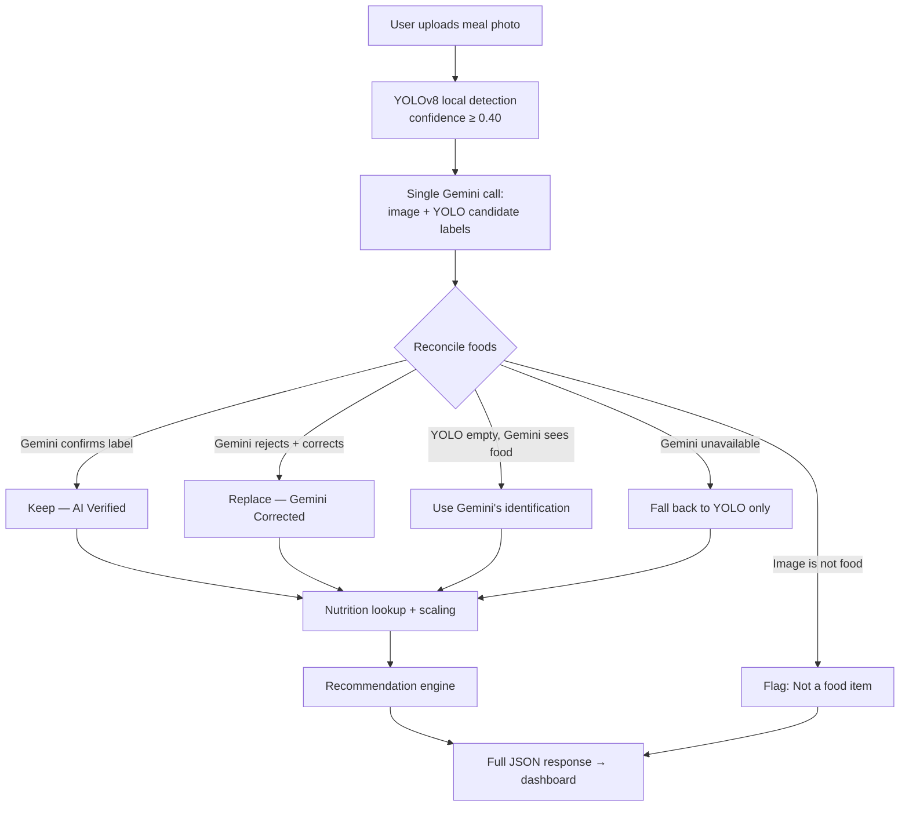

# AI‑Driven Platform for Food Recognition, Allergen Detection, and Personalized Nutrition Guidance

> **Decode your food. Protect your health.**
>
> An integrated, AI‑powered platform that recognizes food from photos, cross‑verifies it with a multimodal LLM, scans packaged‑food labels for allergens and risky additives, and turns all of it into personalized nutrition and food‑safety guidance.

The platform combines **computer vision** (a local YOLOv8 model), **generative AI** (Google Gemini for vision + OpenRouter for label reasoning), a **local additive knowledge base** with live public‑data enrichment (PubChem, OpenFDA, Open Food Facts), and a clean **React dashboard** — all in one app.

---

## Table of Contents

1. [What This Project Is](#1-what-this-project-is)
2. [Core Features](#2-core-features)
3. [The Meal Analysis Pipeline (Flagship)](#3-the-meal-analysis-pipeline-flagship)
4. [System Architecture](#4-system-architecture)
5. [Technology Stack](#5-technology-stack)
6. [Repository Structure](#6-repository-structure)
7. [Backend Deep Dive](#7-backend-deep-dive)
8. [Frontend Deep Dive](#8-frontend-deep-dive)
9. [AI Integrations](#9-ai-integrations)
10. [API Reference](#10-api-reference)
11. [Supported Foods](#11-supported-foods)
12. [Setup & Installation](#12-setup--installation)
13. [Environment Variables](#13-environment-variables)
14. [Running the App](#14-running-the-app)
15. [Configuration Knobs](#15-configuration-knobs)
16. [Gemini Quota & Rate Limits](#16-gemini-quota--rate-limits)
17. [Troubleshooting](#17-troubleshooting)
18. [Security Notes](#18-security-notes)
19. [Limitations & Future Work](#19-limitations--future-work)
20. [Credits & License](#20-credits--license)

---

## 1. What This Project Is

This is a **single web application with three integrated modes**, switchable from the header:

| Mode | What it does | Primary AI |
|------|--------------|------------|
| **Meal Analysis** | Upload a meal photo → identify foods → estimate calories, macros & micronutrients → food‑safety insight → personalized recommendations | Local **YOLOv8** + **Google Gemini** (vision) |
| **Label Scanner** | Upload/paste a packaged‑food label → structured allergen, additive, ingredient & health‑risk report personalized to your health profile | **OpenRouter** vision model |
| **Interaction Lab** | Study combinations of food additives and their chemical interaction risk, enriched with live public data | Local KB + **PubChem / OpenFDA** |

It originated as two separate projects — **NutriVision** (meal recognition) and **Adisense / AddiSafe** (label scanning + additive lab) — which were merged into this unified app. The shared design language (Tailwind + shadcn/ui) makes all three modes feel native.

---

## 2. Core Features

- 📷 **Photo‑based food recognition** with a custom‑trained YOLOv8 model (33 food classes).
- 🤖 **Multimodal LLM cross‑verification** — Gemini reviews the model's labels and **confirms, corrects, or overrides** them, identifies foods the model doesn't know, and flags non‑food images.
- 🥗 **Nutrition estimation** — calories, protein, carbs, fat, fiber, plus estimated micronutrients, scaled by AI portion estimates.
- 🛡️ **Food‑safety panel** — freshness, cooking style, oil level, visual insights, cautious safety notes.
- 🎯 **Personalized recommendations** — meal score, goal‑based advice, missing nutrients, healthier swaps, "improve my meal" simulation, allergy notes, hydration, daily/weekly tracking.
- 🏷️ **Label intelligence** — allergen safety, ingredient deep‑dive, additive detection, NOVA‑style health score with an interaction penalty.
- 🧪 **Additive interaction lab** — network graph of additive interactions, live PubChem/OpenFDA enrichment, barcode → Open Food Facts lookup.
- 👤 **Health profiles** — allergens, intolerances, dietary restrictions, and medical conditions personalize every result. Persisted in `localStorage`.
- 🌗 **Light/dark theme**, responsive bento‑grid UI.
- 🪶 **Graceful degradation** — every external dependency (Gemini, gateway, Redis) is optional; the app keeps working (with reduced features) when any is unavailable.

---

## 3. The Meal Analysis Pipeline (Flagship)

The meal‑analysis flow is a **two‑layer recognition system**: a fast local model proposes, and a multimodal LLM arbitrates.



### How arbitration works

1. **Local detection.** `best.pt` (YOLOv8) detects foods above a `0.40` confidence threshold, grouping by class and returning per‑item confidence and bounding boxes.
2. **One Gemini call.** The same image **plus the YOLO candidate labels** are sent to Gemini in a *single* request that returns **both**:
   - an **identification verdict** — `isFood`, a `notFoodReason`, Gemini's own `items` (name + confidence), and a per‑label `modelVerdicts` map (`matches`, `confidence`, `correctedName`); and
   - the **quality/safety analysis** — freshness, cooking style, oil level, portion estimate, visual insights, etc.
3. **Reconciliation** (`services/identification.py`) merges the two sources into one decision:

| Situation | Decision | Item source tag | UI badge |
|-----------|----------|-----------------|----------|
| Gemini confirms a YOLO label | `confirmed` | `model_confirmed` | **AI Verified** |
| Gemini rejects & corrects a label | `reconciled` | `gemini_override` | **Gemini Corrected** |
| YOLO found nothing, Gemini sees food | `gemini_only` | `gemini` | **Gemini Identified** |
| Gemini gave no verdict on a label | (kept) | `model` | **Local Model** |
| Image isn't food | `not_food` | — | **Not a food item** + reason |
| Gemini unavailable / rate‑limited | `model_only` | `model` | **Local Model** |

Each surviving detection carries **both** confidence scores (`model_confidence` and `gemini_confidence`) so the UI can show, e.g., `Model 59% · Gemini 97%`.

> **Why merge the two Gemini calls?** Identification and quality analysis were originally two separate requests. They were combined into **one** call to halve latency, cost, and — critically — **rate‑limit pressure** on Gemini's free tier (see [§16](#16-gemini-quota--rate-limits)).

4. **Nutrition.** Reconciled foods are mapped to `data/nutrition.json` (per‑piece calories/macros), multiplied by count, and scaled by Gemini's portion estimate. Unknown foods fall back to a sensible default profile.
5. **Recommendations.** A rules engine produces the meal score, category, positives, improvements, missing nutrients, healthier alternatives, goal advice, hydration, allergy warnings, and daily/weekly analytics.

---

## 4. System Architecture

```
┌─────────────────────────────────────────────────────────────────┐
│  Browser (React + Vite dev server, :3000)                        │
│   ├─ Meal Analysis  ──fetch /nutri-api/*──┐                       │
│   ├─ Label Scanner  ──► OpenRouter API     │ (Vite proxy)         │
│   └─ Interaction Lab ─fetch /api/*─┐        │                     │
└────────────────────────────────────┼────────┼────────────────────┘
                                     │        │
              ┌──────────────────────┘        └──────────────────┐
              ▼                                                    ▼
┌──────────────────────────────┐              ┌─────────────────────────────┐
│ Express gateway (server.js)  │              │ Flask backend (:5000)        │
│ :8787  (optional)            │              │  /api/analyze                │
│  /api/proxy/pubchem/:name    │              │  /api/health/gemini          │
│  /api/proxy/openfda/:name    │              │  /api/test/gemini            │
│  /api/proxy/off/:barcode     │              │   ├─ YOLOv8 (best.pt)        │
│  Redis cache (optional)      │              │   ├─ Gemini (google‑genai)   │
└──────────────────────────────┘              │   └─ nutrition + rec engine  │
                                              └─────────────────────────────┘
```

### Request routing (Vite proxy)

The Vite dev server on port **3000** proxies:

- `/nutri-api/*` → `http://127.0.0.1:5000/api/*` — the **NutriVision Flask backend** (the prefix is rewritten so it never clashes with the gateway).
- `/api/*` → `http://localhost:8787/*` — the **Adisense gateway** (the frontend probes `/api/health` and falls back to direct upstream calls when it's offline).

---

## 5. Technology Stack

**Frontend**
- React 19, TypeScript, Vite 6
- Tailwind CSS 4, shadcn/ui (Radix‑based), lucide‑react icons
- recharts (charts), d3 (network graph), react‑markdown
- `barcode-detector` for in‑browser barcode scanning

**Backend (Meal Analysis)**
- Python (3.13 recommended), Flask 3, flask‑cors
- Ultralytics YOLOv8, PyTorch, torchvision, OpenCV, Pillow, NumPy
- `google-genai` (Gemini SDK), python‑dotenv

**Gateway (optional, Interaction Lab)**
- Node.js + Express, express‑rate‑limit
- Redis (optional; in‑memory TTL fallback)

**External services**
- Google Gemini (vision) · OpenRouter (label reasoning) · PubChem · OpenFDA · Open Food Facts

---

## 6. Repository Structure

```
combined/
├─ index.html                     # Vite entry
├─ package.json                   # frontend + gateway scripts
├─ vite.config.ts                 # dev server + proxy (/nutri-api, /api)
├─ server.js                      # optional Express gateway (:8787)
├─ .env.example                   # frontend/gateway env template
│
├─ src/
│  ├─ main.tsx                    # React mount
│  ├─ App.tsx                     # app shell + mode switcher (scanner/lab/meal)
│  ├─ index.css                   # Tailwind theme tokens (light/dark)
│  ├─ components/
│  │  ├─ MealAnalysis.tsx         # ★ Meal Analysis UI (YOLO + Gemini results)
│  │  ├─ AddiSafeDashboard.tsx    # Interaction Lab
│  │  ├─ InteractionReport.tsx    # additive interaction report
│  │  ├─ NetworkGraph.tsx         # d3 additive interaction graph
│  │  ├─ BarcodeScanner.tsx       # barcode → Open Food Facts
│  │  └─ AdisenseLogo.tsx
│  └─ lib/
│     ├─ nutrivisionApi.ts        # transport for the Flask backend
│     ├─ mealScore.ts             # client‑side meal scoring helpers
│     ├─ openrouter.ts            # Label Scanner transport
│     ├─ prompt.ts                # Label Scanner system prompt
│     ├─ jsonRepair.ts            # repairs/validates model JSON
│     ├─ additives.ts             # local additive knowledge base + rules
│     ├─ additiveEngine.ts        # live additive enrichment (PubChem/OpenFDA)
│     └─ openFoodFacts.ts         # barcode product lookup
│
└─ backend/                       # NutriVision Flask backend (:5000)
   ├─ app.py                      # Flask app factory
   ├─ config.py                   # thresholds, ports, model path
   ├─ requirements.txt
   ├─ .env.example                # backend env template (Gemini)
   ├─ models/best.pt              # YOLOv8 weights (33 classes, ~6 MB)
   ├─ data/nutrition.json         # per‑food nutrition table
   ├─ routes/
   │  └─ analyze.py               # /analyze, /health/gemini, /test/gemini
   └─ services/
      ├─ detector.py              # YOLOv8 inference wrapper
      ├─ gemini_service.py        # ★ combined identify + quality call
      ├─ identification.py        # ★ YOLO↔Gemini reconciliation logic
      ├─ food_safety.py           # food‑safety panel + portion multiplier
      ├─ nutrition.py             # detections → nutrition
      ├─ recommendation.py        # recommendation orchestration
      ├─ recommendation_engine.py # scoring & advice rules
      ├─ nutrition_engine.py      # macro/micro calculations
      ├─ meal_scoring.py          # meal score model
      ├─ meal_tracker.py          # daily/remaining/micros
      ├─ goal_service.py          # daily targets from profile
      └─ history_service.py       # meal history helpers
```

★ = files central to the YOLO + Gemini cross‑verification feature.

---

## 7. Backend Deep Dive

The backend is a Flask app (`app.py`) that registers the `analyze` blueprint under `/api`. CORS is restricted to `http://localhost:3000`, but in normal use traffic flows through the Vite proxy.

**Detection** (`services/detector.py`)
- Loads `models/best.pt` once at startup (GPU if available, else CPU). Ultralytics/Matplotlib config dirs are redirected into the backend folder to avoid polluting the home directory.
- `detect_foods(path)` runs inference, drops detections below `CONFIDENCE_THRESHOLD` (0.40), and groups results by class with max confidence, count, and bounding boxes.

**Gemini** (`services/gemini_service.py`)
- `analyze_and_identify(path, candidate_labels)` makes **one** vision call returning the combined identification + quality JSON, then splits it into a normalized `analysis` dict and `identification` dict.
- Robust error handling classifies failures (`InvalidApiKey`, `RateLimit`, `ModelUnavailable`, `NetworkError`, …) and always degrades gracefully.
- `validate_gemini_connection()` powers the health endpoint with a 120‑second cache.

**Reconciliation** (`services/identification.py`)
- `reconcile_foods(yolo_foods, gemini_id)` implements the decision table in [§3](#3-the-meal-analysis-pipeline-flagship), returning the final food list plus an `identification` summary (`decision`, `isFood`, `notFoodReason`, `rejectedLabels`, …).

**Nutrition & recommendations**
- `nutrition.py` maps each food to `data/nutrition.json` and totals macros.
- `food_safety.py` builds the safety panel and the portion multiplier (Small 0.8 → Very Large 1.5) used to scale nutrition.
- `recommendation.py` + `recommendation_engine.py` + `meal_tracker.py` + `goal_service.py` produce the meal score, advice, missing nutrients, daily targets, and analytics.

---

## 8. Frontend Deep Dive

`App.tsx` is the shell: a landing page, then a dashboard with a header mode switcher (`scanner` / `lab` / `meal`) and a theme toggle.

**Meal Analysis** (`MealAnalysis.tsx`)
- Left: Gemini status chip, health/goal profile form, image uploader (drag‑drop, gallery, or camera capture; JPG/PNG ≤ 5 MB).
- Right: **Detection Results** (per‑food cards with the source badge and dual confidence, or a "Not a food item" panel), nutrition summary (macro pie + stat boxes), recommendation panel (score, food safety, positives, improvements, alternatives, missing nutrients, balance, daily/weekly progress, hydration, grocery suggestions), and editable per‑item count cards.
- Meal history persists in `localStorage` (`nutrivisionMealHistory`).

**Label Scanner** (in `App.tsx` + `lib/openrouter.ts`, `lib/prompt.ts`, `lib/jsonRepair.ts`)
- Sends label image/text + the health‑profile string to an OpenRouter vision model with a primary→fallback model strategy.
- `jsonRepair.ts` cleans markdown fences, fixes smart quotes/trailing commas, repairs truncated objects, and detects "schema echo" responses.
- Renders a structured report: stop banner, health score (with additive interaction penalty), product snapshot, allergy safety, nutrition overview, ingredient deep‑dive, healthier swaps, DIY alternative, medical flags, bottom line.

**Interaction Lab** (`AddiSafeDashboard.tsx`, `lib/additiveEngine.ts`)
- Add additives by name/E‑code, quick‑add chips, or barcode scan.
- Resolves each additive against the local KB + PubChem + OpenFDA (via the gateway when up), computes a weighted‑confidence risk score, and renders a d3 interaction network graph.

Health profiles for the scanner persist under `localStorage` key `healthProfiles`.

---

## 9. AI Integrations

| Concern | Service | Where |
|---------|---------|-------|
| Food identification + visual quality/safety | **Google Gemini** (`gemini-2.5-flash`) via `google-genai` | `backend/services/gemini_service.py` |
| Label reasoning & structured report | **OpenRouter** (vision model + fallback) | `src/lib/openrouter.ts`, `src/lib/prompt.ts` |
| Additive chemistry & adverse events | **PubChem**, **OpenFDA** | `src/lib/additiveEngine.ts`, `server.js` |
| Barcode → product/additives | **Open Food Facts** | `src/lib/openFoodFacts.ts`, `server.js` |

Two different LLM providers are used deliberately: **Gemini** handles *image → food* vision in the backend, while **OpenRouter** handles *label → structured safety report* in the browser. Each is optional and fails soft.

---

## 10. API Reference

Base URL: `http://localhost:5000/api` (proxied as `/nutri-api` from the frontend).

### `POST /analyze`
Analyze a meal image. **multipart/form‑data**:

| Field | Type | Notes |
|-------|------|-------|
| `image` | file | JPG/PNG, ≤ 5 MB (required) |
| `goal` | string | `weight_loss` \| `muscle_gain` \| `maintenance` |
| `daily_calorie_target` | int | default 2000 |
| `health_profile` | JSON array | e.g. `["diabetes","hypertension"]` |
| `age`, `gender`, `height_cm`, `weight_kg`, `activity_level` | — | optional profile fields |

**Response (abridged):**
```jsonc
{
  "success": true,
  "detected_foods": [
    { "food_name": "Margherita Pizza", "count": 1, "confidence": 0.97,
      "source": "gemini_override", "status": "gemini_decided",
      "model_confidence": null, "gemini_confidence": 0.97, "bounding_boxes": [] }
  ],
  "identification": {
    "decision": "reconciled", "isFood": true, "notFoodReason": "",
    "rejectedLabels": ["Omlette"], "geminiItems": [ ... ]
  },
  "nutrition": { "items": [...], "totals": {...}, "micronutrients": {...} },
  "gemini_analysis": { "freshness": "...", "cookingStyle": "...", "oilLevel": "...", "enabled": true },
  "food_safety": { ... },
  "meal_rating": 7, "recommendations": [...], "healthier_alternatives": [...],
  "daily_targets": {...}, "today_remaining": {...}, "weekly_analytics": {...}
}
```
> A non‑food image returns `identification.decision == "not_food"` with an empty `detected_foods` and a human‑readable `notFoodReason`.

### `GET /health/gemini`
Returns Gemini connectivity (`Connected` / `Failed`), the active model, and a diagnostic reason. `?debug=true` includes the raw exception. `200` when connected, `503` otherwise.

### `POST /test/gemini`
Quick Gemini‑only check on an uploaded image (`multipart/form-data` with `image`).

---

## 11. Supported Foods

The bundled YOLOv8 model (`best.pt`) is trained on **33 classes** (mostly Indian dishes + common fruits/nuts):

```
Biriyani, Chole, Dal Makhani, Dosa, Gulab Jamun, Idly, Khichdi, Mango,
Omlette, Paapad, Plain Rice, Poha, Poori, Rajma, Rasgulla, Roti, Sambhar,
Uttapam, Vada, almond, apple, apricots, banana, dragon fruit, grapes, guava,
orange, peach, pear, pineapple, strawberry, sugar apple, walnut
```

**Anything outside this list is exactly what the Gemini layer is for** — it identifies foods the model was never trained on, corrects misclassifications, and rejects non‑food images. `data/nutrition.json` contains a broader nutrition table (~60 foods) so Gemini‑identified items still resolve to nutrition data where possible.

---

## 12. Setup & Installation

### Prerequisites
- **Node.js** 18+ and npm
- **Python** 3.10–3.13 (3.13 recommended)
- A **Google Gemini API key** (free at <https://aistudio.google.com/apikey>) for Meal Analysis
- *(optional)* an **OpenRouter API key** for the Label Scanner
- *(optional)* **Redis** for gateway caching

### Clone
```bash
git clone https://github.com/jashuanish/-AI-Driven-Platform-for-Food-Recognition-Allergen-Detection-and-Personalized-Nutrition-Guidance.git
cd -AI-Driven-Platform-for-Food-Recognition-Allergen-Detection-and-Personalized-Nutrition-Guidance
```

### Frontend deps
```bash
npm install
```

### Backend deps
```bash
cd backend
pip install -r requirements.txt
cd ..
```

---

## 13. Environment Variables

### Backend — `backend/.env` (copy from `backend/.env.example`)
```ini
GEMINI_API_KEY=your_gemini_api_key_here
GEMINI_MODEL=gemini-2.5-flash
```

### Frontend / Gateway — `.env` (copy from `.env.example`)
```ini
OPENROUTER_API_KEY="your_openrouter_key"   # Label Scanner
GATEWAY_PORT=8787                          # Express gateway
REDIS_URL=redis://localhost:6379           # optional; in‑memory fallback if absent
# CACHE_TTL_*, RATE_LIMIT_*, UPSTREAM_TIMEOUT_MS — see .env.example
```

> 🔒 **Never commit real keys.** `.env*` files are git‑ignored (only `.env.example` templates are tracked).

---

## 14. Running the App

You can run up to three processes. The **frontend is always required**; the **Flask backend is required for Meal Analysis**; the **gateway is optional**.

**1. Frontend (required)**
```bash
npm run dev          # http://localhost:3000
```

**2. Flask backend (required for Meal Analysis)**
```bash
cd backend
python app.py        # http://localhost:5000
```

**3. Gateway (optional — Interaction Lab live enrichment)**
```bash
npm run server       # http://localhost:8787
```

Then open **http://localhost:3000**, click **Get Started**, and use the header to switch between **Label Scanner**, **Interaction Lab**, and **Meal Analysis**.

**Other scripts:** `npm run build` (production build → `dist/`), `npm run preview`, `npm run lint` (TypeScript check).

---

## 15. Configuration Knobs

`backend/config.py`:

| Setting | Default | Meaning |
|---------|---------|---------|
| `CONFIDENCE_THRESHOLD` | `0.40` | Minimum YOLO confidence to keep a detection |
| `MAX_IMAGE_SIZE_MB` | `5` | Max upload size |
| `FLASK_PORT` | `5000` | Backend port |
| `CORS_ORIGIN` | `http://localhost:3000` | Allowed browser origin |
| `YOLO_MODEL_PATH` | `models/best.pt` | Model weights path |

Gemini model is set via `GEMINI_MODEL` in `backend/.env`.

---

## 16. Gemini Quota & Rate Limits

The Gemini **free tier** is limited **per Google Cloud project, per model, per day** — for `gemini-2.5-flash` this can be as low as **~20 requests/day**. Because each meal analysis is **one** Gemini call (after the identification + quality calls were merged), that's roughly **~20 analyses/day** on a free key.

What happens at the limit:
- The backend receives `429 RESOURCE_EXHAUSTED`, classifies it as `RateLimit`, and **falls back to local YOLO only** — the app keeps working, the UI shows *"Gemini unavailable"*, and detections are tagged **Local Model**.

How to get more headroom:
- Use a key from a **different project** (fresh daily bucket), or switch `GEMINI_MODEL` to another model with its own quota (e.g. `gemini-flash-latest`), or **enable billing** on the project for much higher limits.

> A brand‑new key in the *same* project shares the *same* exhausted quota — switching projects (or enabling billing) is the real fix.

---

## 17. Troubleshooting

| Symptom | Cause / Fix |
|---------|-------------|
| "Unable to reach the NutriVision backend" | Flask isn't running on `:5000`. Start `python app.py`. |
| Gemini chip shows **unavailable** | Missing/invalid key, or daily quota hit (see [§16](#16-gemini-quota--rate-limits)). Check `GET /api/health/gemini`. |
| Every food shows **Local Model** (never AI Verified) | Gemini is down/rate‑limited; arbitration is in graceful‑fallback mode. |
| "Only jpg and png files are supported" | Convert the image; HEIC/WebP aren't accepted by the backend. |
| Backend slow on first request | YOLO weights load on startup; first inference also warms up. |
| Interaction Lab data missing | Gateway offline and/or upstream APIs slow — it falls back to direct calls and the local KB. |
| Label Scanner errors | Missing `OPENROUTER_API_KEY`, or the model returned unparseable JSON (retry — `jsonRepair` recovers most cases). |

---

## 18. Security Notes

- **Secrets live only in `.env` files**, which are git‑ignored. Only `.env.example` placeholders are committed.
- The backend validates uploads (extension, size, and a Pillow `verify()` pass) and deletes the temp file after each request.
- CORS is restricted to the dev origin; production deployments should tighten origins, add auth, and put the Flask app behind a real WSGI server.
- This tool provides **informational** food‑safety and nutrition guidance only — it is **not** medical advice and intentionally uses cautious language for safety/freshness.

---

## 19. Limitations & Future Work

- The YOLO model covers **33 classes**; broad coverage relies on the Gemini layer. Retraining/expanding the model would improve offline accuracy.
- Nutrition values are **per‑piece estimates**; true portions vary. Portion scaling is AI‑estimated, not measured.
- Free‑tier Gemini quota constrains throughput (see [§16](#16-gemini-quota--rate-limits)).
- Possible extensions: barcode → nutrition for Meal Analysis, multi‑item portion segmentation, user accounts & cloud history, on‑device inference, and a unified backend for all three modes.

---

## 20. Credits & License

Built with **Ultralytics YOLOv8**, **Google Gemini**, **OpenRouter**, **PubChem**, **OpenFDA**, **Open Food Facts**, **React**, **Vite**, **Tailwind CSS**, and **shadcn/ui**.

No license file is currently included — add one (e.g. MIT) if you intend others to reuse the code.

---

*This README documents the `combined/` integrated application. Mode names in the UI: **Label Scanner**, **Interaction Lab**, and **Meal Analysis**.*
